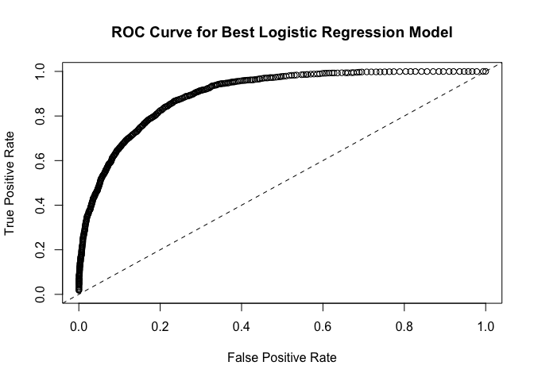
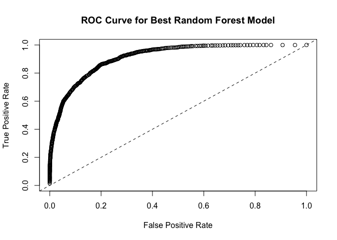
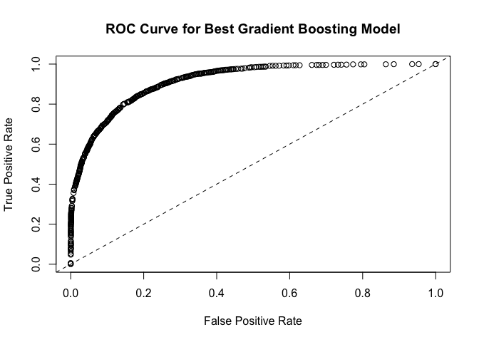
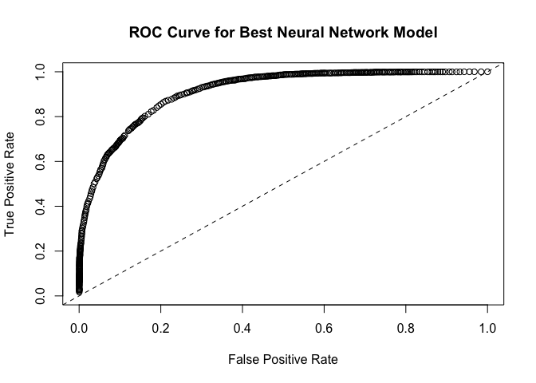
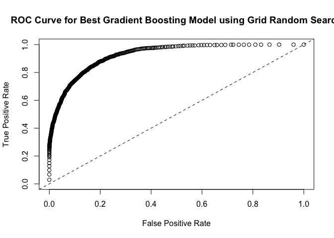

Classification Models using H2O Machine Learning Engine in R
================

1. What is H2O Machine Learning Engine
--------------------------------------

H2O is open-source software for big-data analysis. It allows users to fit thousands of potential models as part of discovering patterns in data. The H2O software runs can be called from the statistical package R, Python, and other environments. It is used for exploring and analyzing datasets held in cloud computing systems and in the Apache Hadoop Distributed File System as well as in the conventional operating-systems Linux, macOS, and Microsoft Windows. The H2O software is written in Java, Python, and R. Its graphical-user interface is compatible with four browsers: Chrome, Safari, Firefox, and Internet Explorer.

In this repo, I'll demonstrate how to build different classification machine learning models (including Logistic Regression, Random Forest, Gradient Boosting Machine, Neural Network, and Ensemble Model) using H2O in R.

2. About the Data
-----------------

The data I used in this project was extracted from the census bureau database and can be found at <https://archive.ics.uci.edu/ml/machine-learning-databases/adult/?C=N;O=A>. The dataset contains 48842 observations and 15 variables. The response variable is a binary categorical variable called "income\_50K" which has two levels: "&lt;=50K" and "&gt;50K".

Predictor variables include:

-   age: continuous.

-   workclass: Private, Self-emp-not-inc, Self-emp-inc, Federal-gov, Local-gov, State-gov, Without-pay, Never-worked.

-   fnlwgt: continuous.

-   education: Bachelors, Some-college, 11th, HS-grad, Prof-school, Assoc-acdm, Assoc-voc, 9th, 7th-8th, 12th, Masters, 1st-4th, 10th, Doctorate, 5th-6th, Preschool.

-   education-num: continuous.

-   marital-status: Married-civ-spouse, Divorced, Never-married, Separated, Widowed, Married-spouse-absent, Married-AF-spouse.

-   occupation: Tech-support, Craft-repair, Other-service, Sales, Exec-managerial, Prof-specialty, Handlers-cleaners, Machine-op-inspct, Adm-clerical, Farming-fishing, Transport-moving, Priv-house-serv, Protective-serv, Armed-Forces.

-   relationship: Wife, Own-child, Husband, Not-in-family, Other-relative, Unmarried.

-   race: White, Asian-Pac-Islander, Amer-Indian-Eskimo, Other, Black.

-   sex: Female, Male.

-   capital-gain: continuous.

-   capital-loss: continuous.

-   hours-per-week: continuous.

-   native-country: United-States, Cambodia, England, Puerto-Rico, Canada, Germany, Outlying-US(Guam-USVI-etc), India, Japan, Greece, South, China, Cuba, Iran, Honduras, Philippines, Italy, Poland, Jamaica, Vietnam, Mexico, Portugal, Ireland, France, Dominican-Republic, Laos, Ecuador, Taiwan, Haiti, Columbia, Hungary, Guatemala, Nicaragua, Scotland, Thailand, Yugoslavia, El-Salvador, Trinadad&Tobago, Peru, Hong, Holand-Netherlands.

The purpose of this project is to determine what factors can be used to predict if an individual is going to earn more than $50K per year. A wide variety of classification machine learning models were employed to attempt to determine the best way to predict if someone's annual income would be greater than $50K.

3. Data Preparation
-------------------

Instead of a whole complete dataset, the UCI Machine Learning Repository website (See URL above) only has the pre-split training (2/3) and test (1/3) datasets. Of course, we can directly use this two datasets as our training set and test set to bulid classification models. Another option is to vertically join this two datasets and re-split the joined dataset into new training, validation and test sets. In this project, I'll do the latter since this will enable us split the data into training, validation, test sets and give us more flexibility on choosing the split percentages. In addition, the rows with missing values were removed before training the model. From the output below, we can see that, after removing rows with missing values, the dataset contains 45222 observations with 34014 positive observations and 11208 negative observations.

``` r
library(dplyr)
library(h2o)
h2o.init(nthreads = -1)
```

    ## 
    ## H2O is not running yet, starting it now...
    ## 
    ## Note:  In case of errors look at the following log files:
    ##     /var/folders/hj/r6k1h_js2cj6gtbt23n5092m0000gn/T//Rtmph4juqL/h2o_huizhang_started_from_r.out
    ##     /var/folders/hj/r6k1h_js2cj6gtbt23n5092m0000gn/T//Rtmph4juqL/h2o_huizhang_started_from_r.err
    ## 
    ## 
    ## Starting H2O JVM and connecting: ... Connection successful!
    ## 
    ## R is connected to the H2O cluster: 
    ##     H2O cluster uptime:         3 seconds 536 milliseconds 
    ##     H2O cluster version:        3.10.4.8 
    ##     H2O cluster version age:    1 month and 22 days  
    ##     H2O cluster name:           H2O_started_from_R_huizhang_ujh154 
    ##     H2O cluster total nodes:    1 
    ##     H2O cluster total memory:   1.78 GB 
    ##     H2O cluster total cores:    8 
    ##     H2O cluster allowed cores:  8 
    ##     H2O cluster healthy:        TRUE 
    ##     H2O Connection ip:          localhost 
    ##     H2O Connection port:        54321 
    ##     H2O Connection proxy:       NA 
    ##     H2O Internal Security:      FALSE 
    ##     R Version:                  R version 3.3.2 (2016-10-31)

``` r
#Download and read in data
url_income_rawdata_train <- "https://archive.ics.uci.edu/ml/machine-learning-databases/adult/adult.data"
destfile_income_rawdata_train <- "income_rawdata_train.data"
download.file(url_income_rawdata_train, destfile_income_rawdata_train)
income_rawdata_train <- read.table("income_rawdata_train.data", sep = ",", strip.white = TRUE, na.strings = "?", stringsAsFactors = FALSE)
url_income_rawdata_test <- "https://archive.ics.uci.edu/ml/machine-learning-databases/adult/adult.test"
destfile_income_rawdata_test <- "income_rawdata_test.data"
download.file(url_income_rawdata_test, destfile_income_rawdata_test)
income_rawdata_test <- read.table("income_rawdata_test.data", sep = ",", skip = 1, strip.white = TRUE, na.strings = "?", stringsAsFactors = FALSE)
#Make the "income_50K" values consistent in the two datasets
income_rawdata_test$V15 = substr(income_rawdata_test$V15, 1, nchar(income_rawdata_test$V15)-1)
#Vertically join the training and test datasets and remove rows with na values
income <- rbind(income_rawdata_train, income_rawdata_test)
income <- na.omit(income)

#Rename column names 
names(income) <- c("age", "workclass", "fnlwgt", "education", "education_num", "marital_status", "occupation", "relationship", "race", "sex", "capital_gain", "capital_loss", "hours_per_week", "native_country", "income_50K")
income %>% group_by(income_50K) %>% summarise(Number_of_Observations = n())
```

    ## # A tibble: 2 x 2
    ##   income_50K Number_of_Observations
    ##        <chr>                  <int>
    ## 1      <=50K                  34014
    ## 2       >50K                  11208

Now, we have a whole complete dataset by merging the original training and test datasets. The next step is to re-split it into new training, validation and test sets. To accomplish this, we can export the vertically joined dataset "income" as a csv file, then imported it into H2O and split it using the `h2o.splitFrame` function. The new training set consisted of 60% of the original data. Both of the validation and test sets consisted of 20% of the original data.

``` r
write.csv(income, file="income.csv", row.names = FALSE)
income_h2o <- h2o.importFile("income.csv")
```

    ## 
      |                                                                       
      |                                                                 |   0%
      |                                                                       
      |=================================================================| 100%

``` r
income_h2o_split <- h2o.splitFrame(income_h2o, ratios = c(0.6,0.2), seed = 1234)
income_h2o_train <- income_h2o_split[[1]]
income_h2o_valid <- income_h2o_split[[2]]
income_h2o_test <- income_h2o_split[[3]]
```

4. Logistic Regression with Random Hyperparameter Search
--------------------------------------------------------

I first built a Logistic Regression model with random hyperparameter search using the H2O machine learning engine in R. Nearly all model algorithms used in machine learning have a set of tuning "knobs" (hyperparameters) which affect how the learning algorithm fits the model to the data. As the number of hyperparameters being tuned increases, and the values that you would like to explore for those hyperparameters increases, you obviously get a combinatorial explosion in the number of models required for an exhaustive search. H2O has supported random hyperparameter search since version 3.8.1.1. For example, with H2O random hyperparameter search, we can search for the best value of regularization terms *α* and *λ* for Generalized Linear Model or ntrees and max\_depth for Gradient Boosting Models.

H2O keeps track of all the models resulting from the search, and allows you to sort the list based on any supported model metric. In this project, all classification models were evaluated using AUC criterion. The output below also shows the parameter values for the selected best Logistic Regression model, AUC value and ROC curve for the validation dataset, and variable coefficients. Specifically, the value of hyperparameters for the best Logistic Regression model are: alpha = 0.144, lambda = 0.005041. In addition, the AUC value for the validation dataset is 0.8967501

``` r
predictors <- names(income_h2o_train)[-15]

hyper_params <- list(alpha = seq(from = 0, to = 1, by = 0.001),
                    lambda = seq(from = 0, to = 1, by = 0.000001)
                    )

search_criteria <- list(strategy = "RandomDiscrete",
                        max_runtime_secs = 10*3600,
                        max_models = 100,
                        stopping_metric = "AUC", 
                        stopping_tolerance = 0.00001, 
                        stopping_rounds = 5, 
                        seed = 1234
                        )

models_glm <- h2o.grid(algorithm = "glm", grid_id = "grd_glm", x = predictors, y = "income_50K", training_frame = income_h2o_train, validation_frame = income_h2o_valid, nfolds = 0, family = "binomial", hyper_params = hyper_params, search_criteria = search_criteria, stopping_metric = "AUC", stopping_tolerance = 1e-5, stopping_rounds = 5, seed = 1234)

models_glm_sort <- h2o.getGrid(grid_id = "grd_glm", sort_by = "auc", decreasing = TRUE)
models_glm_best <- h2o.getModel(models_glm_sort@model_ids[[1]])
```

``` r
#Parameter values for the best model
models_glm_best@allparameters
```

    ## $model_id
    ## [1] "grd_glm_model_4"
    ## 
    ## $training_frame
    ## [1] "RTMP_sid_aefc_2"
    ## 
    ## $validation_frame
    ## [1] "RTMP_sid_aefc_4"
    ## 
    ## $nfolds
    ## [1] 0
    ## 
    ## $seed
    ## [1] 1234
    ## 
    ## $keep_cross_validation_predictions
    ## [1] FALSE
    ## 
    ## $keep_cross_validation_fold_assignment
    ## [1] FALSE
    ## 
    ## $fold_assignment
    ## [1] "AUTO"
    ## 
    ## $ignore_const_cols
    ## [1] TRUE
    ## 
    ## $score_each_iteration
    ## [1] FALSE
    ## 
    ## $family
    ## [1] "binomial"
    ## 
    ## $tweedie_variance_power
    ## [1] 0
    ## 
    ## $tweedie_link_power
    ## [1] 1
    ## 
    ## $solver
    ## [1] "IRLSM"
    ## 
    ## $alpha
    ## [1] 0.144
    ## 
    ## $lambda
    ## [1] 0.005041
    ## 
    ## $lambda_search
    ## [1] FALSE
    ## 
    ## $early_stopping
    ## [1] TRUE
    ## 
    ## $nlambdas
    ## [1] -1
    ## 
    ## $standardize
    ## [1] TRUE
    ## 
    ## $missing_values_handling
    ## [1] "MeanImputation"
    ## 
    ## $compute_p_values
    ## [1] FALSE
    ## 
    ## $remove_collinear_columns
    ## [1] FALSE
    ## 
    ## $intercept
    ## [1] TRUE
    ## 
    ## $non_negative
    ## [1] FALSE
    ## 
    ## $max_iterations
    ## [1] 50
    ## 
    ## $objective_epsilon
    ## [1] 1e-04
    ## 
    ## $beta_epsilon
    ## [1] 1e-04
    ## 
    ## $gradient_epsilon
    ## [1] 1e-04
    ## 
    ## $link
    ## [1] "logit"
    ## 
    ## $prior
    ## [1] -1
    ## 
    ## $lambda_min_ratio
    ## [1] 1e-04
    ## 
    ## $max_active_predictors
    ## [1] 5000
    ## 
    ## $balance_classes
    ## [1] FALSE
    ## 
    ## $max_after_balance_size
    ## [1] 5
    ## 
    ## $max_confusion_matrix_size
    ## [1] 20
    ## 
    ## $max_hit_ratio_k
    ## [1] 0
    ## 
    ## $max_runtime_secs
    ## [1] 35998.8
    ## 
    ## $x
    ##  [1] "native_country" "education"      "occupation"     "workclass"     
    ##  [5] "marital_status" "relationship"   "race"           "sex"           
    ##  [9] "age"            "fnlwgt"         "education_num"  "capital_gain"  
    ## [13] "capital_loss"   "hours_per_week"
    ## 
    ## $y
    ## [1] "income_50K"

``` r
#AUC value for the validation dataset
models_glm_best@model$validation_metrics@metrics$AUC
```

    ## [1] 0.8967501

``` r
#ROC curve for the validation dataset
perf_glm_best <- h2o.performance(models_glm_best, income_h2o_valid)
plot(perf_glm_best, type="roc", main="ROC Curve for Best Logistic Regression Model")
```



``` r
#Variable importance
h2o.varimp(models_glm_best)
```

    ## Standardized Coefficient Magnitudes: standardized coefficient magnitudes
    ##                               names coefficients sign
    ## 1                      capital_gain     1.392780  POS
    ## 2 marital_status.Married-civ-spouse     1.100625  POS
    ## 3                     education_num     0.753170  POS
    ## 4                 relationship.Wife     0.615912  POS
    ## 5        occupation.Exec-managerial     0.529788  POS
    ## 
    ## ---
    ##                                    names coefficients sign
    ## 99  marital_status.Married-spouse-absent     0.000000  POS
    ## 100             marital_status.Separated     0.000000  POS
    ## 101               marital_status.Widowed     0.000000  POS
    ## 102              race.Amer-Indian-Eskimo     0.000000  POS
    ## 103              race.Asian-Pac-Islander     0.000000  POS
    ## 104                           race.Other     0.000000  POS

5. Random Forest with Random Hyperparameter Search
--------------------------------------------------

The second model I built was a Random Forest model with random hyperparameter search. The output below shows the parameter values for the best Random Forest model and AUC value and ROC curve for the validation dataset. Specifically, the value of hyperparameters for the best Random Forest model are: ntrees = 10000 (early stopping), max\_depth = 15, min\_rows = 10, nbins = 30, nbins\_cats = 64, mtries = 2, sample\_rate = 1. In addition, the AUC value for the validation dataset is 0.9125689.

The ROC curve can be used to determine the trade-off between the sensitivity (True Positive) of the model versus the specificity (False Positive Rate). For the best Random Forest model, the curve does a fairly good job and this model has relatively high sensitivity and low specificity. In other words, the model is pretty accurate.

The variable importance are also provied in the output below. According to the output, factors such as race, sex, native\_country, fnlwgt, workclass, hours\_per\_week have little predictive power. Other factors, such as relationship, marital status, capital gain, occupation, education, age, and capital loss were more influential in determining if an individual's annual income would be greater than $50K.

``` r
hyper_params <- list(ntrees = 10000,  ## early stopping
                    max_depth = 5:15, 
                    min_rows = c(1,5,10,20,50,100),
                    nbins = c(30,100,300),
                    nbins_cats = c(64,256,1024),
                    sample_rate = c(0.7,1),
                    mtries = c(-1,2,6)
                    )

search_criteria <- list(strategy = "RandomDiscrete",
                        max_runtime_secs = 10*3600,
                        max_models = 100,
                        stopping_metric = "AUC", 
                        stopping_tolerance = 0.00001, 
                        stopping_rounds = 5, 
                        seed = 1234
                        )

models_rf <- h2o.grid(algorithm = "randomForest", grid_id = "grd_rf", x = predictors, y = "income_50K", training_frame = income_h2o_train, validation_frame = income_h2o_valid, nfolds = 0, hyper_params = hyper_params, search_criteria = search_criteria, stopping_metric = "AUC", stopping_tolerance = 1e-3, stopping_rounds = 2, seed = 1234)

models_rf_sort <- h2o.getGrid(grid_id = "grd_rf", sort_by = "auc", decreasing = TRUE)
models_rf_best <- h2o.getModel(models_rf_sort@model_ids[[1]])
```

``` r
#Parameter values for the best model
models_rf_best@allparameters
```

    ## $model_id
    ## [1] "grd_rf_model_26"
    ## 
    ## $training_frame
    ## [1] "RTMP_sid_aefc_2"
    ## 
    ## $validation_frame
    ## [1] "RTMP_sid_aefc_4"
    ## 
    ## $nfolds
    ## [1] 0
    ## 
    ## $keep_cross_validation_predictions
    ## [1] FALSE
    ## 
    ## $keep_cross_validation_fold_assignment
    ## [1] FALSE
    ## 
    ## $score_each_iteration
    ## [1] FALSE
    ## 
    ## $score_tree_interval
    ## [1] 0
    ## 
    ## $fold_assignment
    ## [1] "AUTO"
    ## 
    ## $ignore_const_cols
    ## [1] TRUE
    ## 
    ## $balance_classes
    ## [1] FALSE
    ## 
    ## $max_after_balance_size
    ## [1] 5
    ## 
    ## $max_confusion_matrix_size
    ## [1] 20
    ## 
    ## $max_hit_ratio_k
    ## [1] 0
    ## 
    ## $ntrees
    ## [1] 10000
    ## 
    ## $max_depth
    ## [1] 15
    ## 
    ## $min_rows
    ## [1] 10
    ## 
    ## $nbins
    ## [1] 30
    ## 
    ## $nbins_top_level
    ## [1] 1024
    ## 
    ## $nbins_cats
    ## [1] 64
    ## 
    ## $r2_stopping
    ## [1] 1.797693e+308
    ## 
    ## $stopping_rounds
    ## [1] 2
    ## 
    ## $stopping_metric
    ## [1] "AUC"
    ## 
    ## $stopping_tolerance
    ## [1] 0.001
    ## 
    ## $max_runtime_secs
    ## [1] 35970.85
    ## 
    ## $seed
    ## [1] 1234
    ## 
    ## $build_tree_one_node
    ## [1] FALSE
    ## 
    ## $mtries
    ## [1] 2
    ## 
    ## $sample_rate
    ## [1] 1
    ## 
    ## $binomial_double_trees
    ## [1] FALSE
    ## 
    ## $col_sample_rate_change_per_level
    ## [1] 1
    ## 
    ## $col_sample_rate_per_tree
    ## [1] 1
    ## 
    ## $min_split_improvement
    ## [1] 1e-05
    ## 
    ## $histogram_type
    ## [1] "AUTO"
    ## 
    ## $categorical_encoding
    ## [1] "AUTO"
    ## 
    ## $x
    ##  [1] "age"            "workclass"      "fnlwgt"         "education"     
    ##  [5] "education_num"  "marital_status" "occupation"     "relationship"  
    ##  [9] "race"           "sex"            "capital_gain"   "capital_loss"  
    ## [13] "hours_per_week" "native_country"
    ## 
    ## $y
    ## [1] "income_50K"

``` r
#AUC value for the validation dataset
models_rf_best@model$validation_metrics@metrics$AUC
```

    ## [1] 0.9125689

``` r
#ROC curve for the validation dataset
perf_rf_best <- h2o.performance(models_rf_best, income_h2o_valid)
plot(perf_rf_best, type="roc", main="ROC Curve for Best Random Forest Model")
```



``` r
#Variable importance
h2o.varimp(models_rf_best)
```

    ## Variable Importances: 
    ##          variable relative_importance scaled_importance percentage
    ## 1  marital_status         7617.608887          1.000000   0.292964
    ## 2    capital_gain         3357.236328          0.440720   0.129115
    ## 3   education_num         2696.079590          0.353927   0.103688
    ## 4       education         2500.650879          0.328272   0.096172
    ## 5      occupation         2294.258545          0.301178   0.088234
    ## 6    relationship         2129.190918          0.279509   0.081886
    ## 7             age         1493.358032          0.196040   0.057433
    ## 8    capital_loss         1208.520996          0.158648   0.046478
    ## 9  hours_per_week          874.082092          0.114745   0.033616
    ## 10            sex          707.461487          0.092872   0.027208
    ## 11      workclass          442.532135          0.058093   0.017019
    ## 12 native_country          348.266968          0.045719   0.013394
    ## 13         fnlwgt          211.391617          0.027750   0.008130
    ## 14           race          121.226936          0.015914   0.004662

6. Gradient Boosting Machine with Random Hyperparameter Search
--------------------------------------------------------------

A Gradient Boosting Machine model was also built as a candidate model. The output below shows the parameter values for the best Gradient Boosting Machine model as well as AUC value and ROC curve for the validation dataset. Specifically, the value of hyperparameters for the best Gradient Boosting Machine model are: ntrees = 10000 (early stopping), max\_depth = 7, min\_rows = 5, nbins = 300, nbins\_cats = 64, learn\_rate = 0.1, learn\_rate\_annealing = 1, sample\_rate = 1, col\_sample\_rate = 1. In addition, the AUC value for the validation dataset is 0.9157708.

For the best Gradient Boosting Machine model, the ROC curve does a fairly good job and this model has relatively high sensitivity and low specificity. In other words, the model is very accurate.

``` r
hyper_params <- list(ntrees = 10000,  ## early stopping
                     max_depth = 5:15, 
                     min_rows = c(1,5,10,20,50,100),
                     learn_rate = c(0.001,0.01,0.1),  
                     learn_rate_annealing = c(0.99,0.999,1),
                     sample_rate = c(0.7,1),
                     col_sample_rate = c(0.7,1),
                     nbins = c(30,100,300),
                     nbins_cats = c(64,256,1024)
                     )

search_criteria <- list(strategy = "RandomDiscrete",
                        max_runtime_secs = 10*3600,
                        max_models = 100,
                        stopping_metric = "AUC", 
                        stopping_tolerance = 0.00001, 
                        stopping_rounds = 5, 
                        seed = 1234
                        )

models_gbm <- h2o.grid(algorithm = "gbm", grid_id = "grd_gbm", x = predictors, y = "income_50K", training_frame = income_h2o_train, validation_frame = income_h2o_valid, nfolds = 0, hyper_params = hyper_params, search_criteria = search_criteria, stopping_metric = "AUC", stopping_tolerance = 1e-3, stopping_rounds = 2, seed = 1234)

models_gbm_sort <- h2o.getGrid(grid_id = "grd_gbm", sort_by = "auc", decreasing = TRUE)
models_gbm_best <- h2o.getModel(models_gbm_sort@model_ids[[1]])
```

``` r
#Parameter values for the best model
models_gbm_best@allparameters
```

    ## $model_id
    ## [1] "grd_gbm_model_1"
    ## 
    ## $training_frame
    ## [1] "RTMP_sid_aefc_2"
    ## 
    ## $validation_frame
    ## [1] "RTMP_sid_aefc_4"
    ## 
    ## $nfolds
    ## [1] 0
    ## 
    ## $keep_cross_validation_predictions
    ## [1] FALSE
    ## 
    ## $keep_cross_validation_fold_assignment
    ## [1] FALSE
    ## 
    ## $score_each_iteration
    ## [1] FALSE
    ## 
    ## $score_tree_interval
    ## [1] 0
    ## 
    ## $fold_assignment
    ## [1] "AUTO"
    ## 
    ## $ignore_const_cols
    ## [1] TRUE
    ## 
    ## $balance_classes
    ## [1] FALSE
    ## 
    ## $max_after_balance_size
    ## [1] 5
    ## 
    ## $max_confusion_matrix_size
    ## [1] 20
    ## 
    ## $max_hit_ratio_k
    ## [1] 0
    ## 
    ## $ntrees
    ## [1] 10000
    ## 
    ## $max_depth
    ## [1] 7
    ## 
    ## $min_rows
    ## [1] 5
    ## 
    ## $nbins
    ## [1] 300
    ## 
    ## $nbins_top_level
    ## [1] 1024
    ## 
    ## $nbins_cats
    ## [1] 64
    ## 
    ## $r2_stopping
    ## [1] 1.797693e+308
    ## 
    ## $stopping_rounds
    ## [1] 2
    ## 
    ## $stopping_metric
    ## [1] "AUC"
    ## 
    ## $stopping_tolerance
    ## [1] 0.001
    ## 
    ## $max_runtime_secs
    ## [1] 35995.76
    ## 
    ## $seed
    ## [1] 1234
    ## 
    ## $build_tree_one_node
    ## [1] FALSE
    ## 
    ## $learn_rate
    ## [1] 0.1
    ## 
    ## $learn_rate_annealing
    ## [1] 1
    ## 
    ## $distribution
    ## [1] "bernoulli"
    ## 
    ## $quantile_alpha
    ## [1] 0.5
    ## 
    ## $tweedie_power
    ## [1] 1.5
    ## 
    ## $huber_alpha
    ## [1] 0.9
    ## 
    ## $sample_rate
    ## [1] 1
    ## 
    ## $col_sample_rate
    ## [1] 1
    ## 
    ## $col_sample_rate_change_per_level
    ## [1] 1
    ## 
    ## $col_sample_rate_per_tree
    ## [1] 1
    ## 
    ## $min_split_improvement
    ## [1] 1e-05
    ## 
    ## $histogram_type
    ## [1] "AUTO"
    ## 
    ## $max_abs_leafnode_pred
    ## [1] 1.797693e+308
    ## 
    ## $pred_noise_bandwidth
    ## [1] 0
    ## 
    ## $categorical_encoding
    ## [1] "AUTO"
    ## 
    ## $x
    ##  [1] "age"            "workclass"      "fnlwgt"         "education"     
    ##  [5] "education_num"  "marital_status" "occupation"     "relationship"  
    ##  [9] "race"           "sex"            "capital_gain"   "capital_loss"  
    ## [13] "hours_per_week" "native_country"
    ## 
    ## $y
    ## [1] "income_50K"

``` r
#AUC value for the validation dataset
models_gbm_best@model$validation_metrics@metrics$AUC
```

    ## [1] 0.9157708

``` r
#ROC curve for the validation dataset
perf_gbm_best <- h2o.performance(models_gbm_best, income_h2o_valid)
plot(perf_gbm_best, type="roc", main="ROC Curve for Best Gradient Boosting Model")
```



7. Neural Network with Random Hyperparameter Search
---------------------------------------------------

The best Neural Network model was also selected by using random hyperparameter search. The output below shows the parameter values for the best Neural Network (Deep Learning) model as well as AUC value and ROC curve for the validation dataset.

``` r
hyper_params <- list(activation = c("Rectifier", "Maxout", "Tanh", "RectifierWithDropout", "MaxoutWithDropout", "TanhWithDropout"), 
                     hidden = list(c(50, 50, 50, 50), c(200, 200), c(200, 200, 200), c(200, 200, 200, 200)), 
                     epochs = c(50, 100, 200), 
                     l1 = c(0, 0.00001, 0.0001), 
                     l2 = c(0, 0.00001, 0.0001), 
                     adaptive_rate = c(TRUE, FALSE), 
                     rate = c(0, 0.1, 0.005, 0.001), 
                     rate_annealing = c(1e-8, 1e-7, 1e-6), 
                     rho = c(0.9, 0.95, 0.99, 0.999), 
                     epsilon = c(1e-10, 1e-8, 1e-6, 1e-4), 
                     momentum_start = c(0, 0.5),
                     momentum_stable = c(0.99, 0.5, 0), 
                     input_dropout_ratio = c(0, 0.1, 0.2)
                     )

search_criteria <- list(strategy = "RandomDiscrete",
                        max_runtime_secs = 10*3600,
                        max_models = 100,
                        stopping_metric = "AUC", 
                        stopping_tolerance = 0.00001, 
                        stopping_rounds = 5, 
                        seed = 1234
                        )

models_dl <- h2o.grid(algorithm = "deeplearning", grid_id = "grd_dl", x = predictors, y = "income_50K", training_frame = income_h2o_train, validation_frame = income_h2o_valid, nfolds = 0, hyper_params = hyper_params, search_criteria = search_criteria, stopping_metric = "AUC", stopping_tolerance = 1e-3, stopping_rounds = 2, seed = 1234)

models_dl_sort <- h2o.getGrid(grid_id = "grd_dl", sort_by = "auc", decreasing = TRUE)
models_dl_best <- h2o.getModel(models_dl_sort@model_ids[[1]])
```

``` r
#Parameter values for the best model
models_dl_best@allparameters
```

    ## $model_id
    ## [1] "grd_dl_model_53"
    ## 
    ## $training_frame
    ## [1] "RTMP_sid_aefc_2"
    ## 
    ## $validation_frame
    ## [1] "RTMP_sid_aefc_4"
    ## 
    ## $nfolds
    ## [1] 0
    ## 
    ## $keep_cross_validation_predictions
    ## [1] FALSE
    ## 
    ## $keep_cross_validation_fold_assignment
    ## [1] FALSE
    ## 
    ## $fold_assignment
    ## [1] "AUTO"
    ## 
    ## $ignore_const_cols
    ## [1] TRUE
    ## 
    ## $score_each_iteration
    ## [1] FALSE
    ## 
    ## $balance_classes
    ## [1] FALSE
    ## 
    ## $max_after_balance_size
    ## [1] 5
    ## 
    ## $max_confusion_matrix_size
    ## [1] 20
    ## 
    ## $max_hit_ratio_k
    ## [1] 0
    ## 
    ## $overwrite_with_best_model
    ## [1] TRUE
    ## 
    ## $use_all_factor_levels
    ## [1] TRUE
    ## 
    ## $standardize
    ## [1] TRUE
    ## 
    ## $activation
    ## [1] "RectifierWithDropout"
    ## 
    ## $hidden
    ## [1] 200 200 200 200
    ## 
    ## $epochs
    ## [1] 100
    ## 
    ## $train_samples_per_iteration
    ## [1] -2
    ## 
    ## $target_ratio_comm_to_comp
    ## [1] 0.05
    ## 
    ## $seed
    ## [1] 1234
    ## 
    ## $adaptive_rate
    ## [1] TRUE
    ## 
    ## $rho
    ## [1] 0.99
    ## 
    ## $epsilon
    ## [1] 1e-06
    ## 
    ## $rate
    ## [1] 0.005
    ## 
    ## $rate_annealing
    ## [1] 1e-08
    ## 
    ## $rate_decay
    ## [1] 1
    ## 
    ## $momentum_start
    ## [1] 0.5
    ## 
    ## $momentum_ramp
    ## [1] 1e+06
    ## 
    ## $momentum_stable
    ## [1] 0.99
    ## 
    ## $nesterov_accelerated_gradient
    ## [1] TRUE
    ## 
    ## $input_dropout_ratio
    ## [1] 0.2
    ## 
    ## $l1
    ## [1] 1e-05
    ## 
    ## $l2
    ## [1] 1e-05
    ## 
    ## $max_w2
    ## [1] 3.402823e+38
    ## 
    ## $initial_weight_distribution
    ## [1] "UniformAdaptive"
    ## 
    ## $initial_weight_scale
    ## [1] 1
    ## 
    ## $loss
    ## [1] "Automatic"
    ## 
    ## $distribution
    ## [1] "AUTO"
    ## 
    ## $quantile_alpha
    ## [1] 0.5
    ## 
    ## $tweedie_power
    ## [1] 1.5
    ## 
    ## $huber_alpha
    ## [1] 0.9
    ## 
    ## $score_interval
    ## [1] 5
    ## 
    ## $score_training_samples
    ## [1] 10000
    ## 
    ## $score_validation_samples
    ## [1] 0
    ## 
    ## $score_duty_cycle
    ## [1] 0.1
    ## 
    ## $classification_stop
    ## [1] 0
    ## 
    ## $regression_stop
    ## [1] 1e-06
    ## 
    ## $stopping_rounds
    ## [1] 2
    ## 
    ## $stopping_metric
    ## [1] "AUC"
    ## 
    ## $stopping_tolerance
    ## [1] 0.001
    ## 
    ## $max_runtime_secs
    ## [1] 32475.36
    ## 
    ## $score_validation_sampling
    ## [1] "Uniform"
    ## 
    ## $diagnostics
    ## [1] TRUE
    ## 
    ## $fast_mode
    ## [1] TRUE
    ## 
    ## $force_load_balance
    ## [1] TRUE
    ## 
    ## $variable_importances
    ## [1] FALSE
    ## 
    ## $replicate_training_data
    ## [1] TRUE
    ## 
    ## $single_node_mode
    ## [1] FALSE
    ## 
    ## $shuffle_training_data
    ## [1] FALSE
    ## 
    ## $missing_values_handling
    ## [1] "MeanImputation"
    ## 
    ## $quiet_mode
    ## [1] FALSE
    ## 
    ## $autoencoder
    ## [1] FALSE
    ## 
    ## $sparse
    ## [1] FALSE
    ## 
    ## $col_major
    ## [1] FALSE
    ## 
    ## $average_activation
    ## [1] 0
    ## 
    ## $sparsity_beta
    ## [1] 0
    ## 
    ## $max_categorical_features
    ## [1] 2147483647
    ## 
    ## $reproducible
    ## [1] FALSE
    ## 
    ## $export_weights_and_biases
    ## [1] FALSE
    ## 
    ## $mini_batch_size
    ## [1] 1
    ## 
    ## $categorical_encoding
    ## [1] "AUTO"
    ## 
    ## $elastic_averaging
    ## [1] FALSE
    ## 
    ## $elastic_averaging_moving_rate
    ## [1] 0.9
    ## 
    ## $elastic_averaging_regularization
    ## [1] 0.001
    ## 
    ## $x
    ##  [1] "native_country" "education"      "occupation"     "workclass"     
    ##  [5] "marital_status" "relationship"   "race"           "sex"           
    ##  [9] "age"            "fnlwgt"         "education_num"  "capital_gain"  
    ## [13] "capital_loss"   "hours_per_week"
    ## 
    ## $y
    ## [1] "income_50K"

``` r
#AUC value for the validation dataset
models_dl_best@model$validation_metrics@metrics$AUC
```

    ## [1] 0.9112577

``` r
#ROC curve for the validation dataset
perf_dl_best <- h2o.performance(models_dl_best, income_h2o_valid)
plot(perf_dl_best, type="roc", main="ROC Curve for Best Neural Network Model")
```



8. Ensemble Model
-----------------

In this project, a stacking ensemble model was also created by combining four base models including Logistic Regression, Random Forest, Gradient Boosting Machine, and Neural Network. The value of hyperparameters in the four base models are the same as the hyperparameters in the best models selected before.

``` r
md_lr <- h2o.glm(x = predictors, y = "income_50K", training_frame = income_h2o_train, nfolds = 10, fold_assignment = "Modulo", keep_cross_validation_predictions = TRUE, seed = 1234, family = "binomial", alpha = 0.144, lambda = 0.005041)

md_rf <- h2o.randomForest(x = predictors, y = "income_50K", training_frame = income_h2o_train, nfolds = 10, fold_assignment = "Modulo", keep_cross_validation_predictions = TRUE, ntrees = 10000, max_depth = 15, min_rows = 10, nbins = 30, nbins_cats = 64, mtries = 2, sample_rate =1, stopping_metric = "AUC", stopping_tolerance = 1e-3, stopping_rounds = 2, seed = 1234 )

md_gbm <- h2o.gbm(x = predictors, y = "income_50K", training_frame = income_h2o_train, nfolds = 10, fold_assignment = "Modulo", keep_cross_validation_predictions = TRUE, ntrees = 10000, max_depth = 7, min_rows = 5, nbins = 300, nbins_cats = 64, learn_rate = 0.1, learn_rate_annealing = 1, sample_rate = 1, col_sample_rate = 1, stopping_metric = "AUC", stopping_tolerance = 1e-3, stopping_rounds = 2, seed = 1234 )

md_dl <- h2o.deeplearning(x = predictors, y = "income_50K", training_frame = income_h2o_train, nfolds = 10, fold_assignment = "Modulo", keep_cross_validation_predictions = TRUE, activation = "Rectifier", hidden = c(200, 200), epochs = 200, adaptive_rate = FALSE, rho = 0.95, epsilon = 1e-10, rate = 0.005, rate_annealing = 1e-6, momentum_start = 0.5, momentum_stable = 0.99, input_dropout_ratio = 0.1, l1 = 1e-4, l2 = 0, stopping_metric = "AUC", stopping_tolerance = 1e-3, stopping_rounds = 2, seed = 1234 )

md_ens <- h2o.stackedEnsemble(x = predictors, y = "income_50K", training_frame = income_h2o_train, base_models = list(md_lr@model_id, md_rf@model_id, md_gbm@model_id, md_dl@model_id))
```

9. Model Comparison
-------------------

The output below shows the AUC value for the four base models and the ensemble model. In addition, the coefficients of the ensemble model are also provided in the output. According to the AUC values, we can see that the Gradient Boosting Machine model has the highest prediction accuracy (even better than the ensemble model).

``` r
h2o.auc(h2o.performance(md_lr, income_h2o_valid))
```

    ## [1] 0.8967501

``` r
h2o.auc(h2o.performance(md_rf, income_h2o_valid))
```

    ## [1] 0.9137352

``` r
h2o.auc(h2o.performance(md_gbm, income_h2o_valid))
```

    ## [1] 0.9242344

``` r
h2o.auc(h2o.performance(md_dl, income_h2o_valid))
```

    ## [1] 0.8995764

``` r
h2o.auc(h2o.performance(md_ens, income_h2o_valid))
```

    ## [1] 0.9218019

``` r
h2o.getModel(md_ens@model$metalearner$name)@model$coefficients_table
```

    ## Coefficients: glm coefficients
    ##                                      names coefficients
    ## 1                                Intercept    -3.397017
    ## 2           GLM_model_R_1499985874357_9561     0.141401
    ## 3           DRF_model_R_1499985874357_9594     3.437632
    ## 4           GBM_model_R_1499985874357_9998     3.017208
    ## 5 DeepLearning_model_R_1499985874357_10612     0.455156
    ##   standardized_coefficients
    ## 1                 -1.678401
    ## 2                  0.036939
    ## 3                  0.936153
    ## 4                  0.933948
    ## 5                  0.134437

After comparing the AUC value of different models, the Gradient Boosting Machine model **md\_gbm** was selected to be the best model for prediction. We can get the AUC value and ROC curve of the best model for the test dataset as shown below. For the best model, the ROC curve does a fairly good job and this model has relatively high sensitivity and low specificity. In other words, the model is very accurate.

``` r
h2o.auc(h2o.performance(md_gbm, income_h2o_test))
```

    ## [1] 0.925068

``` r
perf_best_model <- h2o.performance(md_gbm, income_h2o_test)
plot(perf_best_model, type="roc", main="ROC Curve for Best Gradient Boosting Model using Grid Random Search")
```



10. Conclusion
--------------

In total, five methods (including Logistic Regression, Random Forest, Gradient Boosting Machine, Neural Network, and Stacking Ensemble model) were conducted and evaluated. The main conclusion is that factors such as race, sex, native\_country, fnlwgt, workclass, hours\_per\_week do very little to predict the income. However, relationship, marital status, capital gain, occupation, education, age, and capital loss are more determinant of an individual's annual income.

Additionally, models that used Gradient Boosting Machine and the Stacking Ensemble method were more accurate than other models. In general, all of the models tested were pretty accurate in making predictions regarding an individual's annual income.
